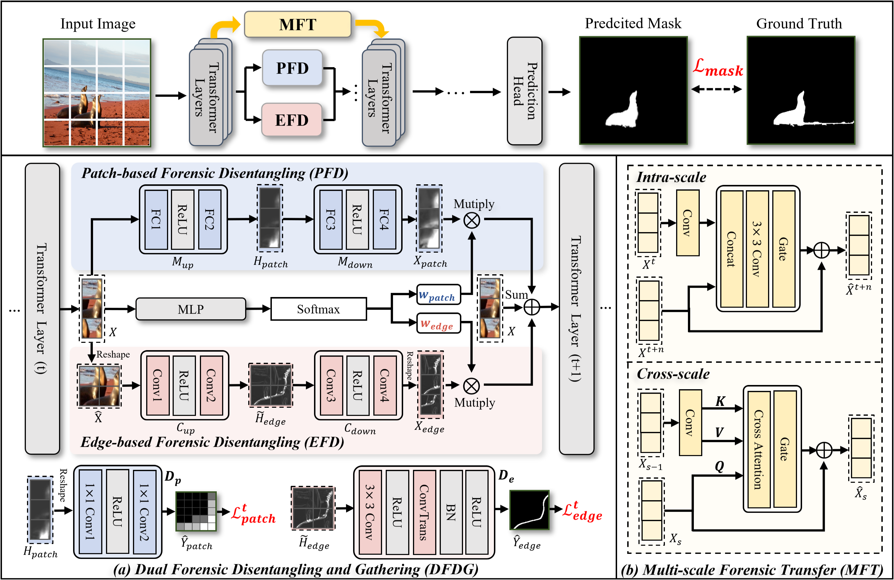

# DG-Force: Disentangling and Gathering Forensic Cues is Needed for Image Manipulation Localization

Official implementation of **DG-Force**, accepted by **ECCV 2026**.

<p align="center">
  
<p align="center">

**DG-Force** is an image manipulation localization method that disentangles patch-level and edge-level forensic cues and adaptively gathers the most informative evidence across scales for robust pixel-level forgery localization.
## Environment Installation

```bash
conda create -n dg_force python=3.10 -y
conda activate dg_force

pip install torch==2.8.0 torchvision==0.23.0 --index-url https://download.pytorch.org/whl/cu128
pip install -r requirements.txt
```

## Datasets

We follow the **CAT-Net protocol** and use the same dataset format as **IMDLBenCo**. Please refer to [IMDLBenCo](https://github.com/scu-zjz/IMDLBenCo) for details about dataset organization and annotation format.

Prepare dataset annotation files under `data/`:

```text
data/train_datasets.json
data/val_datasets.json
data/test_datasets.json
```

The training datasets include:

```text
CASIA2, 
Fantastic Reality, 
IMD2020, 
compRAISE,
COCO Copy-Move (CM-COCO),
COCO Boundary Copy-Move (BCM),
COCO Boundary Copy-Move Composite (BCMC),
COCO Splicing (SP-COCO)
```

The standard testing datasets include:

```text
COVERAGE, CASIA v1, Columbia, NIST16
```

Example format of `data/train_datasets.json`:

```json
[
    ["JsonDataset", "/path/to/CASIA2.json"],
    ["JsonDataset", "/path/to/FantasticReality.json"],
    ["JsonDataset", "/path/to/IMD2020.json"],
    ["JsonDataset", "/path/to/compRAISE1024.json"],
    ["JsonDataset", "/path/to/bcm.json"],
    ["JsonDataset", "/path/to/bcmc.json"],
    ["JsonDataset", "/path/to/cm.json"],
    ["JsonDataset", "/path/to/sp.json"]
]
```

Example format of `data/test_datasets.json`:

```json
{
    "coverage": "/path/to/coverage.json",
    "casia_v1": "/path/to/CASIA1.json",
    "columbia": "/path/to/columbia.json",
    "nist2016": "/path/to/NIST16.json"
}
```
Please refer to [IMDLBenCo](https://github.com/scu-zjz/IMDLBenCo) for the format of individual dataset JSON file, and to the `data/` folder of [MVSS-Net](https://github.com/dong03/MVSS-Net/tree/master) for the detailed sample list content of the dataset.

## Pretrained Models
Pretrained models can be downloaded from:
- Google Drive: TODO (link coming soon)
- [Baidu Drive](https://pan.baidu.com/s/1onM-8--luEoWbWTRCzvRPg?pwd=tgxm)

Download the `mit-b3` pretrained weight and place it as:

```text
pretrain_weight/mit_b3.pth
```

To run a quick test, download the DG-Force checkpoint from the provided links.

## Training

```bash
bash train.sh
```

## Testing

Standard image manipulation localization test:

```bash
bash test.sh
```

Robustness test:

```bash
bash test_robustness.sh
```

## Acknowledgement

This codebase is built upon [IMDLBenCo](https://github.com/scu-zjz/IMDLBenCo) and [Mesorch](https://github.com/scu-zjz/Mesorch). We sincerely thank the authors for their excellent benchmark and codebase for image manipulation detection and localization.
